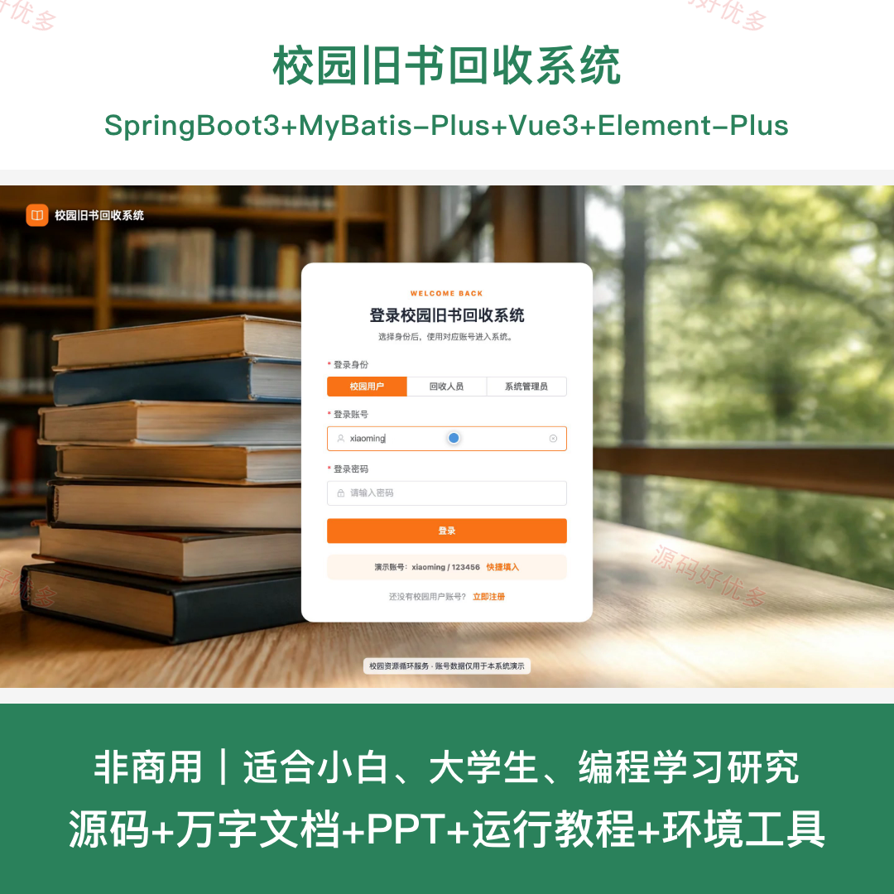
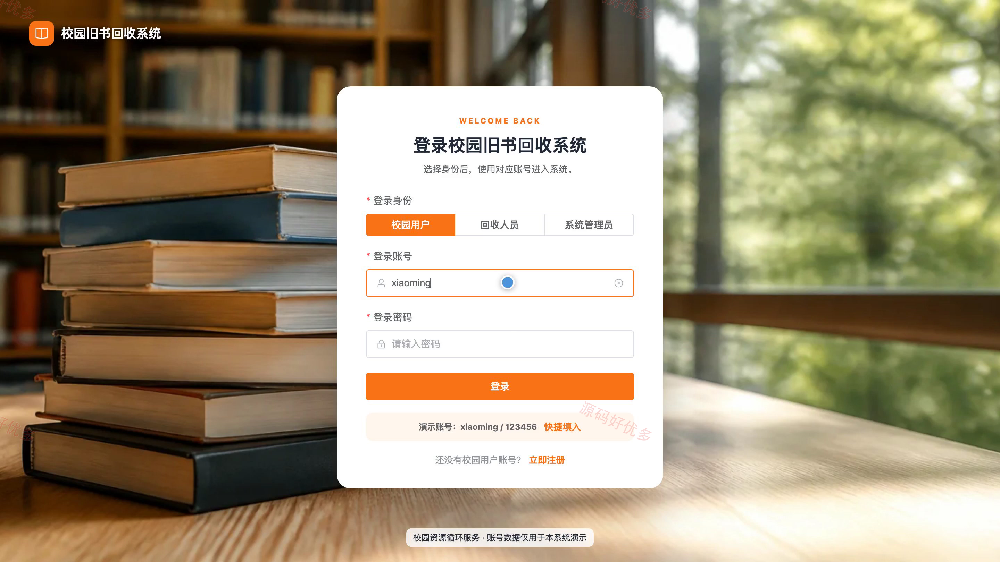
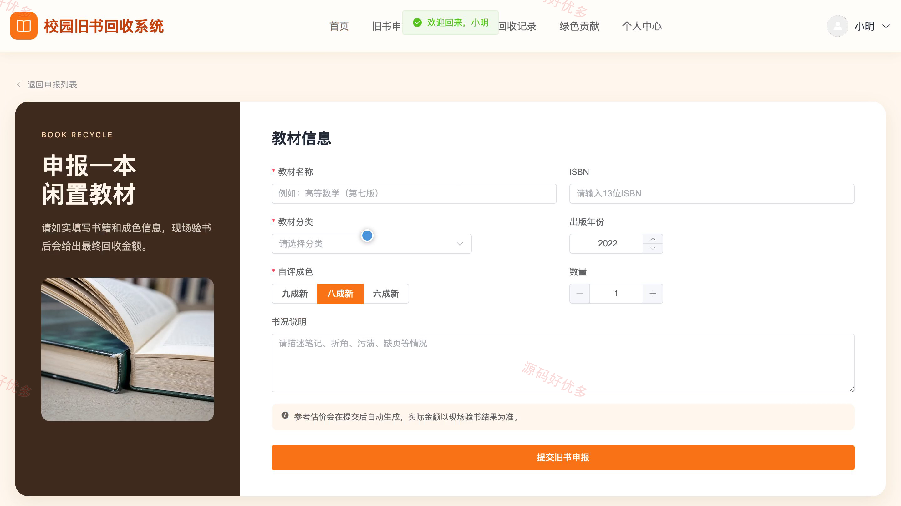
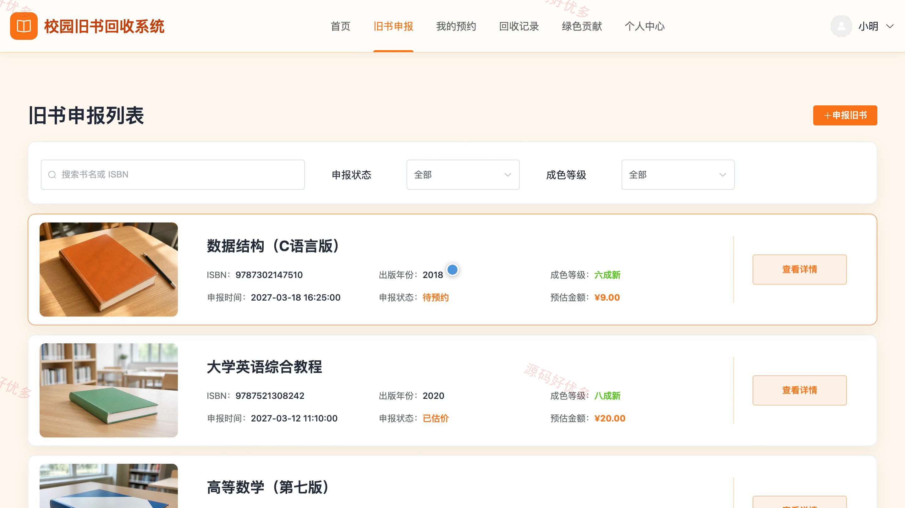
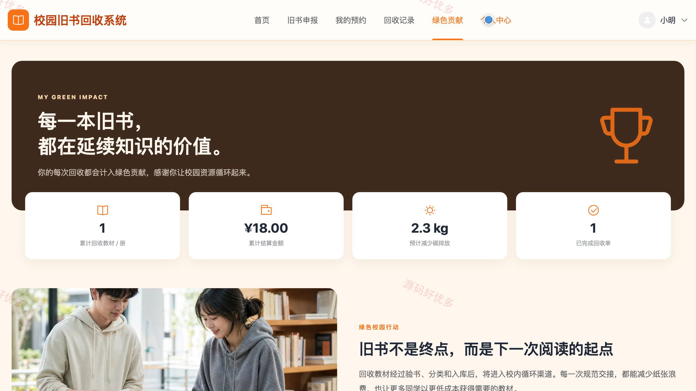
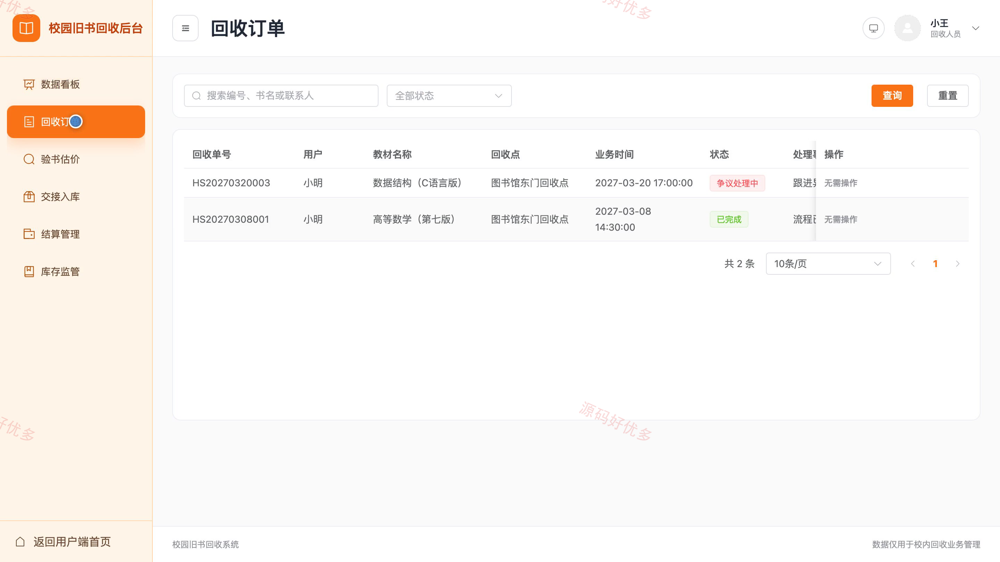
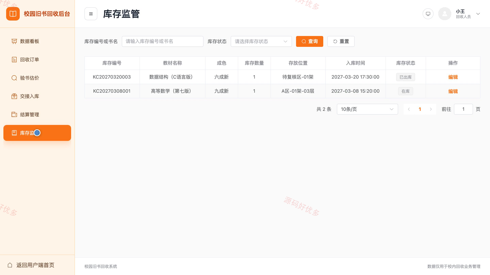
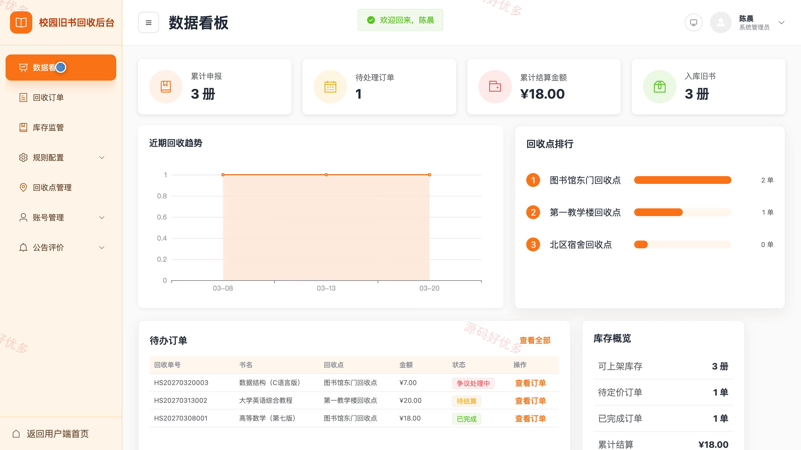
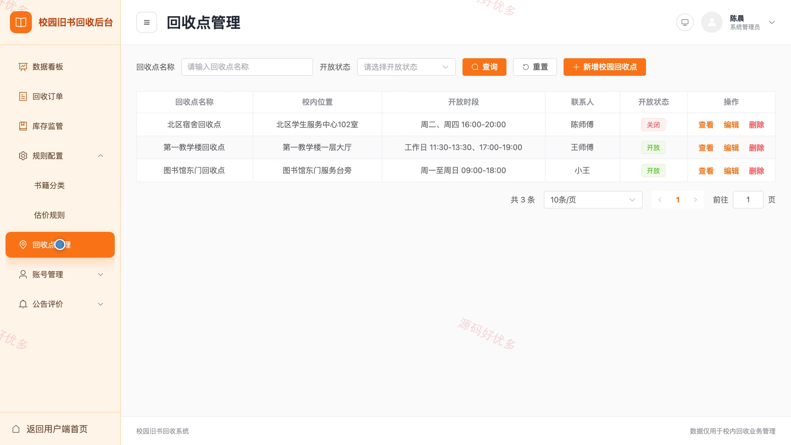

# bs109A
bs109A校园旧书回收系统
## 源码问题查看主页咨询

### 一、关键词
旧书回收、教材回收、校园循环利用、闲置教材处理、绿色回收

### 二、作品包含
源码+数据库+万字设计文档+PPT+全套环境和工具资源+本地部署教程

### 三、项目技术
前端技术： Html、Css、Js、Vue3.4、Element-Plus
后端技术：Java、SpringBoot3.2.0、MyBatis-Plus

### 四、运行环境（以下版本亲测，其他版本兼容性请自行测试）
开发工具：IDEA/eclipse + VSCODE

数据库：MySQL5.7+（共12张表）

数据库管理工具：Navicat10以上版本

环境配置软件： JDK17 + Maven3.6

前端Nodejs：20.20.2

浏览器：谷歌浏览器

### 五、项目介绍
项目编号：bs109A

面向校园旧书回收场景，校园用户可提交旧书信息、查询估价并预约校内回收点，回收人员负责受理、验书、交接、入库和结算，系统管理员维护账号、分类、估价规则、回收点及公告评价，并统计回收量和绿色贡献。

角色：校园用户、回收人员、系统管理员

校园用户功能：旧书申报、回收估价、回收预约、进度查询、回收记录、公告反馈、绿色贡献、个人中心。

回收人员功能：回收订单、预约受理、验书估价、交接入库、结算确认、库存管理、异常处理、数据看板。

系统管理员功能：用户与回收人员管理、书籍分类管理、估价规则管理、回收点管理、回收订单监管、库存监管、公告与评价管理、数据统计。

### 六、运行截图

